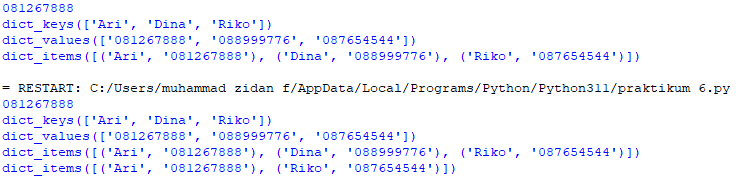
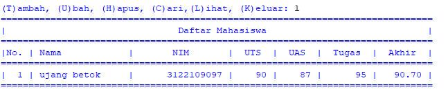
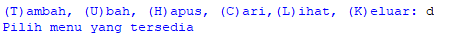

# PROSES / LANGKAH - LANGKAH PRAKTIKUM 6
## Membuat dictionary dari daftar kontak

- Nama sebagai key dan menggunakan nomor sebagai value

- Tampilan kontak dari Ari di bawah ini

- Menambahkan kontak baru dengan menggunakan nama Riko nomor 087654544

- Mengubah kontak Dina dengan nomor yang baru 088999776

- Menampilkan semua daftar nama di atas

- Menampilkan semua daftar nomor di atas

- Untuk menampilkan tampilan daftar nama dan nomor

  
- Menampilkan semua daftar nama dan nomor yang tertera di atas

  
- Menghapus kontak dina 

- Untuk menampilkan menggunakan program seperti di bawah ini

- Hasil kode program

 

###  TUGAS PRAKTIKUM 6

# Daftar Nilai siswa menggunakan dictionary

  - Langkah awal kita harus membuat dictionary kosong kemudian akan di isi inputan data pada saat program di jalankan 
  
 

- Langkah kedua kemudian kita akan membuat kondisi perulangan dan membuat sebuah keterangan untuk pilihan menu yang akan menjalankan program tersebut 

- Langkah ketiga membuat syntax untuk menambahkan data 

- Langkah keempat ketika kita akan menginputkan data t maka akan muncul beberapa data,data  yang barusan kita inputan akan masuk ke dictionary,data yang di buat tadi dengan data nama 'keys' dan yang tersisa itu sebagai values

- langkah kelima membuat syntax mengubah data

- Langkah ke enam pada saat kita menginputkan data 'u' maka akan muncul mengubah keterangan untuk mengubah data tersebut dan kita akan diminta kembali menginputkan nama yang tadi mau di ubah datanya 'nama {} tidak di temukan' dimana {} untuk mengubah nama atau data yang kita mau

- Langkah ke tujuh membuat syntax menghapus data 

- langkah ke delapan kemudian kita akan menginputakn 'h' maka kemudian kita akan diminta untuk menginputakn nama yang akan kita hapus jika nama tersebut ada di dalam system akan menghapus keys/nama yang tadi di inputkan beserta values pada statement del   d[nama] 

- Langkah ke sembilan membuat syntax untuk mencari data 

- langkah ke sepuluh kemudian ketika kita akan menginputkan 'c' kemudian kita akan diminta untuk menginputkan atau memasukan nama yang akan kita cari tersebut,apabila nama yang di caru ada di dictionary maka akan muncul gambar seperti di bawah ini

- Langkah ke sebelas menampilkan data 

- Langkah ke dua belas kita akan menginputkan 'l' maka secara otomatia sistem yang tadi kita buat akan menampilkan semuanya.jika belum maka akan keluar tampilan 'TIDAK ADA DATA' 

- Langkah ke tiga belas membuat syntax untuk menghentikan perulangan 

- Langkah ke empat belas kemudian kita akan menginputkan 'k ' maka secara otomatis program yang kita inputan tadi akan langsung berhenti

- Langkah ke lima belas membuat syntax apabila memilih pilihan yang tidak ada di menu yang di atas contoh nya saya masukan d

   

- Langkah ke enam belas jika kita ingin menginputkan yang selain ada di menu di atas seperti "t,u,c,l,h,k" maka kemudian kita akan di minta untuk memilih menu yang tersedia

# GAMBAR FLOWCHART PRAKTIKUM

